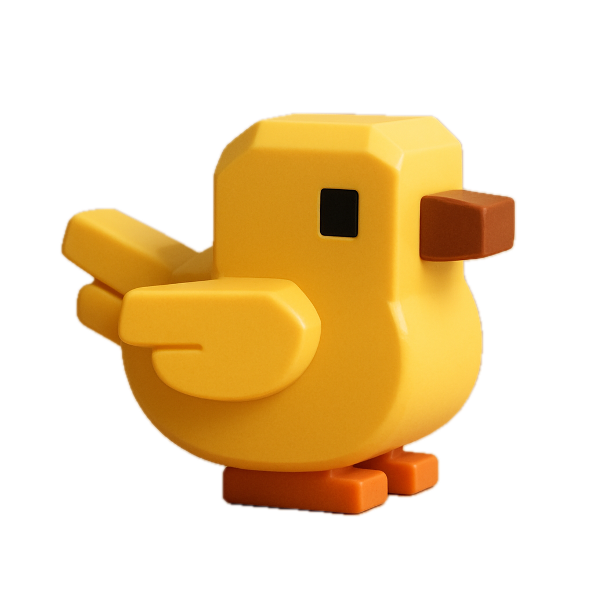

# Flappy Evolution



### Flappy bird learns to fly by neuro-evolution

- Create a generation of 100 birds with a random brain
- The brain decides when to flap, based on 5 sensory inputs of the bird
- The 2 birds that perform best are selected for the next generation
- Those 2 birds make a child, that child gets slight mutations to create a new generation of 100 birds
- After only a few generations, the last surviving bird can avoid all pipes effectively
- This demo loads this pre-trained brain into 3 birds

<br><br><bR>

## ML5 Neural network

### Inputs

- The y-position of the bird
- The y-velocity of the bird
- The y-position of the next top pipe’s opening
- The y-position of the next bottom pipe’s opening
- The x-distance to the next pipe


<figure>
    
    <figcaption>Five sensory inputs - (The Nature of Code by Daniel Shiffman)</figcaption>
</figure>

<br><br><bR>

### Outputs

- Flap or don't flap

<figure>
    
    <figcaption>Resulting Neural Network (The Nature of Code by Daniel Shiffman)</figcaption>
</figure>

<br><br><bR>


### Code

```js
let options = {
    inputs: 5,
    outputs: ["flap", "no flap"],
    task: "classification",
    neuroEvolution: true
};
let brain = ml5.neuralNetwork(options);

let inputs = [...sensory data here...]
let prediction = brain.classify(inputs, (result) => {
    console.log(`I think I should %{result[0].label}`)
})

```
<br><br><bR>


## Links

- https://natureofcode.com/neuroevolution/
- https://docs.ml5js.org/#/reference/neural-network

